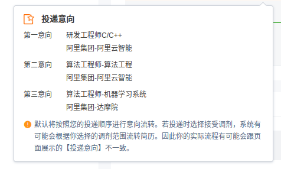

# 实习投递记录

## 字节跳动
> 3020202184@tju.edu.cn
### 5月5日
* [x] 2023-05-06 ~~[算法实习生-抖音](https://jobs.bytedance.com/campus/position/7204702300962474297/detail?spread=B3RU5SF)~~
* [x] 2023-05-06 ~~[计算机视觉实习生-搜索](https://jobs.bytedance.com/campus/position/7202131274357819707/detail?spread=B3RU5SF)~~
* [ ] [计算机视觉算法实习生-Data](https://jobs.bytedance.com/campus/position/7210285184640731429/detail?spread=B3RU5SF)

### 5月6日
* [ ] [后端开发实习生-飞书](https://jobs.bytedance.com/campus/position/7205093230139672891/detail)
* [ ] [后端开发实习生-今日头条](https://jobs.bytedance.com/campus/position/7207349753562515768/detail?spread=B3RU5SF)
* [x] 2023-05-06 ~~[推荐算法实习生-国际化电商](https://jobs.bytedance.com/campus/position/7209937982735681829/detail?spread=B3RU5SF)~~

> 字节的简历投递已经在 4月30号 结束了

## 特斯拉
> 3020202184@tju.edu.cn
### 5月5日
* [ ] [软件开发工程师实习生](https://app.mokahr.com/campus-recruitment/tesla/91939#/job/5b78bbd9-ea83-48cb-86b7-3efe8f8d9b19)

## 阿里
> 3020202184@tju.edu.cn
### 5月5日
* [ ] [阿里（三个）](https://talent.alibaba.com/personal/campus-application?lang=zh)

## 苹果
> 1051666563@qq.com
### 5月5日
* [ ] [Machine Learning/AI Engineering & Research Internship](https://jobs.apple.com/app/zh-cn/profile/info)

## 腾讯
> 1051666563@qq.com
### 5月5日
* [ ] [校园招聘-软件开发-后台开发方向](https://join.qq.com/post.html?pid=1)
> 似乎 腾讯的校招考试已经结束了

## [美团](https://zhaopin.meituan.com/web/personalCenter/deliveryRecord)
> 3020202184@tju.edu.cn
### 5月7日
* [ ] [自然语言处理实习生（智能交互方向）](https://zhaopin.meituan.com/web/position/detail?jobUnionId=1319804754&jobShareType=1&highlightType=campus)
* [ ] [【实习】搜索算法工程师（实习）](https://zhaopin.meituan.com/web/position/detail?jobUnionId=734577326&jobShareType=1&highlightType=campus)
* [ ] [AI研发实习生](https://zhaopin.meituan.com/web/position/detail?jobUnionId=824902529&jobShareType=1&highlightType=campus)
### 5月8日
* [ ] [运维工程师（转正实习）](https://zhaopin.meituan.com/web/position/detail?jobUnionId=1423902675&highlightType=campus)

## [DophinDB](https://app.mokahr.com/campus-recruitment/dolphindb/37786#/candidateHome/applications)
### 5月7日
* [ ] [IT运维实习生](https://app.mokahr.com/campus-recruitment/dolphindb/37786#/job/fab4f530-ad50-44bb-928c-7174260ba9c6)

## [图森](https://app.mokahr.com/campus_apply/tusenweilai/68335#/)
### 5月8日
* [ ] [软件研发实习生-算法平台](https://app.mokahr.com/campus_apply/tusenweilai/68335#/job/b0eea913-edaa-446c-87cc-6e2278226958)

## [蔚来](https://nio.jobs.feishu.cn/campus/?spread=7Q6WWWR)
### 5月8日
* [ ] [实习-自动驾驶软件开发实习生 -自动驾驶](https://nio.jobs.feishu.cn/campus/position/7205128999558400293/detail?spread=7Q6WWWR)

## [拼多多](https://careers.pinduoduo.com/campus/personal-center)
### 5月8日
* [ ] [算法实习、服务端研发](https://careers.pinduoduo.com/campus/personal-center)
